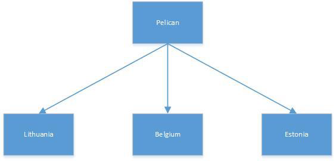

# Spring coding task

Write Spring application (codename: Pelican) which has one GET endpoint (/country/{country}/{word}).

Pelican application depending on country provided in request should call corresponding country application

to get “Hello” translation and as a response should return body:

{“data” : “{word_translation_here}”}

---

Each country application endpoints are identical, just domains are different:

GET /translation/{word}

200, OK
{“translation” : “{word_translation_here }”}

---

With one exception, that Estonia always returns translation in lowercase,
but Pelican application should always return first letter as Uppercase.
Country applications can be mocked. Schema added below.

---

Pelican endpoint call examples:

GET /country/Lithuania/Hello

200, OK
{
“data” : “Labas”
}

---

Pelican endpoint call examples:

GET /country/Estonia/Hello

200, OK
{
“data” : “Tere”
}

